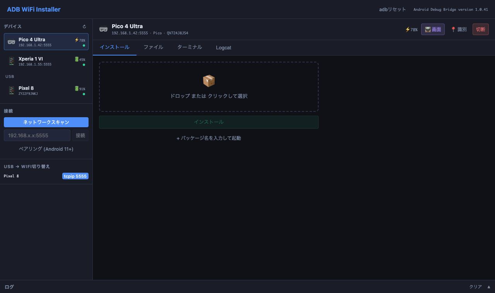
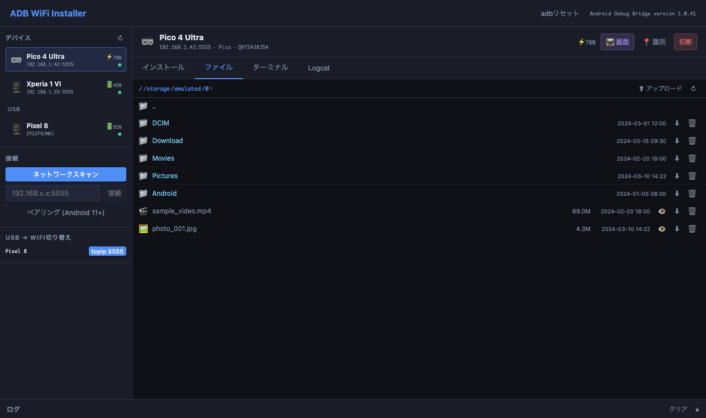

# ADB WiFi Installer

ローカルネットワーク上の Android デバイスを検出し、ADB over WiFi で APK のインストール・管理ができる軽量デスクトップアプリです。
[Tauri](https://tauri.app/) (Rust + React) 製。Mac / Windows 対応。

---

## スクリーンショット

| インストール | ファイルエクスプローラー |
|---|---|
|  |  |

---

## 機能一覧

### デバイス検出・接続

- **ネットワークスキャン** — ローカルサブネットの TCP ポート 5555 をスキャンし、ADB 対応デバイスを自動検出
- **手動接続** — IP アドレス:ポートを直接入力して接続
- **USB → WiFi 切り替え** — USB 接続中のデバイスに `adb tcpip 5555` を送信し、WiFi IP を自動取得してフォームへ入力
- **ワイヤレスペアリング** — Android 11 以降のワイヤレスデバッグ（ペアリングコード方式）に対応
- **USB デバイス表示** — WiFi 接続デバイスと USB 接続デバイスを同時に一覧表示

### デバイス情報表示

- **デバイスタイプ識別** — メーカー・モデル名から VR 🥽 / スマートフォン 📱 / タブレット / TV 📺 を自動判別
- **バッテリー残量** — 残量（%）と充電状態をリアルタイム表示
- **メーカー・モデル・シリアル番号** 表示
- **デバイス識別（光らせる）** — 画面輝度フラッシュ × 3 + フラッシュライト + バイブレーションで物理的にデバイスを特定

### APK インストール・管理

- **APK ファイル選択** — ファイルダイアログで APK を選択
- **ドラッグ＆ドロップ** — APK ファイルをウィンドウにドロップして登録
- **APK 情報表示** — パッケージ名・バージョン名・バージョンコード・署名種別（デバッグ/リリース）を表示
- **インストール** — 進捗率（%）をリアルタイム表示しながらインストール
- **アンインストール** — 確認ダイアログ付きでアンインストール
- **アプリ起動** — インストール済みアプリを即時起動

### ファイルエクスプローラー

- **ストレージ閲覧** — デバイスのファイルシステムをツリー表示（`/storage/emulated/0` から開始）
- **パス直接入力** — パスバーをクリックして任意のパスへ直接ジャンプ
- **シンボリックリンク対応** — シンボリックリンクをクリックでリンク先へ自動移動
- **ファイルダウンロード** — 端末から Mac へ `adb pull` でダウンロード（フォルダも対応）
- **ファイルアップロード** — Mac からデバイスへ `adb push` でアップロード（複数ファイル対応）
- **プレビュー**
  - 画像（PNG / JPG / GIF など）— base64 変換してインライン表示
  - テキスト（TXT / LOG / MD / JSON / XML など）— インライン表示
  - 動画（MP4 など）— 一時フォルダに pull して OS のデフォルトプレーヤーで再生
- **ファイル削除** — 確認ダイアログ付きで削除

### ターミナル（タブ）

- **ADB コマンド直接実行** — `devices` / `connect <ip>` / `shell <cmd>` など任意の ADB コマンドを実行
- **デバイス指定** — プルダウンでデバイスを選ぶと `-s <device>` を自動付与（未選択時はデバイス指定なし）
- **コマンド履歴表示** — 実行コマンドと出力を画面に蓄積表示

### Logcat（タブ）

- **リアルタイムストリーミング** — `adb logcat` の出力を行ごとにリアルタイム表示
- **ログレベル色分け**
  - Verbose — グレー
  - Debug — 青
  - Info — 緑
  - Warning — 黄
  - Error — 赤
  - Fatal — 赤（太字）
- **フィルタ** — `*:W` や `MyTag:D` など logcat フィルタ式を指定可能
- **開始 / 停止** — ワンクリックで開始・停止。実行中はタブに緑の点滅インジケーター表示
- 最新 500 行を保持（古い行は自動削除）

### ログ（タブ）

- **UI 操作ログ** — アプリ内の全操作を時刻付きで記録
- **実行コマンド表示** — UI 操作で裏側に発行された ADB コマンドを `$ adb ...` 形式で表示
- ログレベル別に色分け（info / success / warn / error / cmd）

### その他

- **ADB サーバーリセット** — `adb kill-server && adb start-server` をワンクリックで実行し、接続不良を解消
- **ADB バージョン表示** — ヘッダーに現在の ADB バージョンを表示
- **自動デバイス更新** — 10 秒ごとにデバイス一覧を自動更新

---

## 動作環境

| 項目 | 内容 |
|------|------|
| OS | macOS (Apple Silicon / Intel) / Windows |
| ADB | PATH が通った `adb` コマンド（Android SDK Platform Tools） |
| Android | Android 7.0 以上（ADB over WiFi 使用） |

---

## セットアップ

### 必要なもの

- [Node.js](https://nodejs.org/) 18 以上
- [Rust](https://rustup.rs/)
- [Android SDK Platform Tools](https://developer.android.com/tools/releases/platform-tools)（`adb` コマンド）

### 開発環境での起動

```bash
npm install
npm run tauri dev
```

### リリースビルド（macOS）

```bash
bash build_release_mac.sh
```

コード署名・公証（Notarization）まで自動で行います。Apple Developer Program への登録が必要です。

---

## Android デバイス側の準備

1. **開発者オプション** を有効化（ビルド番号を 7 回タップ）
2. **USB デバッグ** をオン
3. USB で Mac に接続し、アプリの **WiFi 切替** ボタンをクリック
4. USB を抜いて、表示された IP アドレスで接続

Android 11 以降は USB 不要の **ワイヤレスデバッグ**（ペアリング）にも対応しています。

---

## 技術スタック

| レイヤー | 技術 |
|----------|------|
| フレームワーク | [Tauri v2](https://tauri.app/) |
| フロントエンド | React 18 + Vite |
| バックエンド | Rust |
| ADB 通信 | Android SDK `adb` コマンド経由 |
